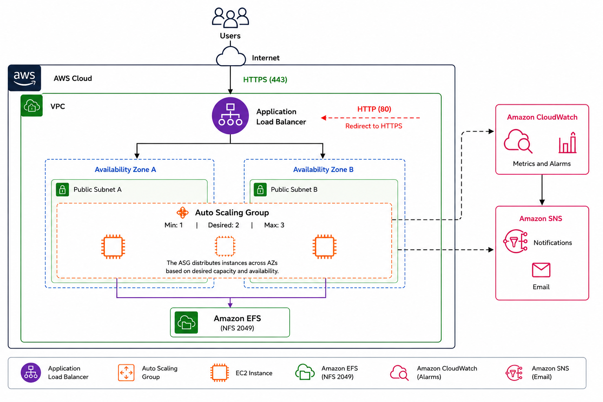

# AWS Scalable Web Infrastructure with Shared EFS & HTTPS 🚀

This repository contains production-ready **Terraform** configurations to deploy a highly available, fault-tolerant, and secure web architecture on AWS. 

The project demonstrates infrastructure-as-code (IaC) best practices by decoupling the compute, storage, and networking layers while enforcing traffic encryption and strict least-privilege security boundaries.

---

## 🎯 High-Level Problem Statement & Solution

### The Challenge
Modern enterprise web applications require an infrastructure that guarantees **zero downtime**, handles **unpredictable traffic spikes**, maintains **consistent user data** across multiple servers, and protects sensitive information from **cyber threats**—all while keeping operational costs optimized.

### The Solution
This project solves these production challenges holistically by implementing a cloud-native, multi-layered architecture:

* **High Availability & Security:** Eliminates single points of failure by distributing traffic across multiple Availability Zones via an Application Load Balancer (ALB), while enforcing end-to-end encryption (HTTPS/443) and complete backend network isolation.
* **Elasticity & Data Persistence:** Automates infrastructure scaling based on real-time application load to reduce idle resource costs, while solving data desynchronization by attaching a centralized, shared Amazon Elastic File System (EFS) to the entire dynamic server fleet.

---

## 🗺️ Technical Architecture Highlights

* **End-to-End Traffic Routing:** ALB acts as the secure reverse proxy utilizing modern SSL/TLS policies from AWS Certificate Manager (ACM). Port 80 (HTTP) traffic is issued an automatic **301 permanent redirect** to port 443 (HTTPS).
* **Dynamic Scaling:** An Auto Scaling Group (ASG) expands (+1 instance) when CPU load sustains >50%, and shrinks (-1 instance) when it drops <25% using CloudWatch alarms.
* **Stateful Syncing:** EFS uses native NFS ports (2049) attached via multi-subnet mount targets, mounted automatically via `user_data.sh`.
* **Infrastructure Alerts:** An **Amazon SNS** topic hooks directly into the ASG lifecycle to dispatch real-time email notifications whenever instances are launched or terminated.

---

## 📁 Repository Structure

* `provider.tf` - Cloud provider declaration and target region settings (`us-east-1`).
* `variables.tf` - Input parameters to easily customize instance counts, types, ports, and thresholds.
* `vpc.tf` - Dynamic discovery of default VPC networking, with built-in filtering logic to exclude unstable or unsupported availability zones (e.g., `us-east-1e`).
* `security.tf` - Strict security group access controls and inter-resource trust relationships.
* `alb.tf` - Configuration for the public load balancer, target groups, and active health probes (`/health`).
* `acm.tf` - SSL/TLS certificate management mapping traffic to secure endpoints.
* `autoscaling.tf` - EC2 Launch Templates, Auto Scaling core policies, and CloudWatch alert thresholds.
* `efs.tf` - Elastic distributed file system definitions and multi-subnet mount targets.
* `sns.tf` - Alerting architecture and automated email subscriber bindings.
* `scripts/user_data.sh` - Automated bash bootstrap script to install Apache (`httpd`), mount network volumes, and deploy application code on runtime.

---

## 🛠️ Tech Stack

* **Infrastructure as Code:** Terraform
* **Cloud Provider:** Amazon Web Services (VPC, EC2, ALB, ASG, EFS, CloudWatch, ACM, SNS)
* **OS / Scripting:** Linux Bash

---

## 🚀 Deployment Guide
 
### Prerequisites
1. [Terraform CLI](https://developer.hashicorp.com/terraform/downloads) installed locally.
2. Local AWS CLI credentials configured with appropriate IAM deployment execution permissions (`aws configure`).
### Execution Steps
 
1. **Clone the repository:**
   ```bash
   git clone https://github.com/agarbar439/aws-high-availability-architecture-terraform
   cd aws-high-availability-architecture-terraform/infra
   ```
 
2. **Initialize workspace:** Download needed providers, registry modules, and backend configurations.
   ```bash
   terraform init
   ```
 
3. **Dry-run evaluation:** Review a comprehensive blueprint of what Terraform intends to build inside your AWS account before it happens.
   ```bash
   terraform plan
   ```
 
4. **Deploy the infrastructure:**
   ```bash
   terraform apply
   ```
 
   Open that URL in your browser to verify the deployment is live.
6. **Teardown** (optional): Destroy all provisioned resources when no longer needed.
   ```bash
   terraform destroy
   ```

   
